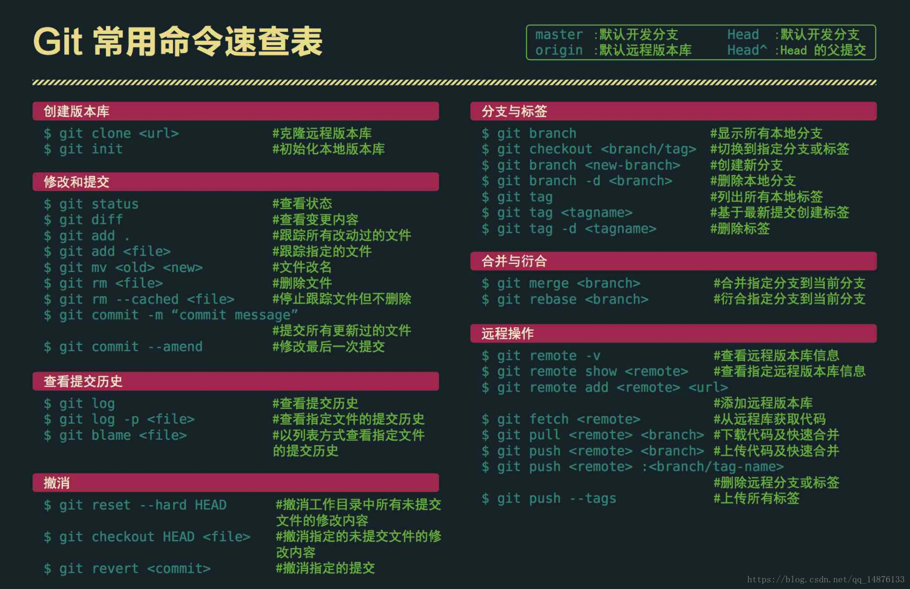

## Git learnning note

### 1. Repositery configuration

安装好Git后，需要先进行以下配置：

```
git config --global user.name "NeeeeeeaL"
git config --global user.email "adam0618@outlook.com"
```
**注意**：` git config -global 参数 ` ，有了这个参数，表示这台机器所有Git仓库都会使用这个配置，当然你也可以对某个仓库指定不同的用户名和邮箱。

### 2. Git commands



创建本地仓库：` git init `

将工作区文件添加到暂存区：` git add `

将暂存区文件提交到仓库：` git commit `

查看仓库当前状态：` git status `

查看文件变更内容： ` git diff 文件名 `

